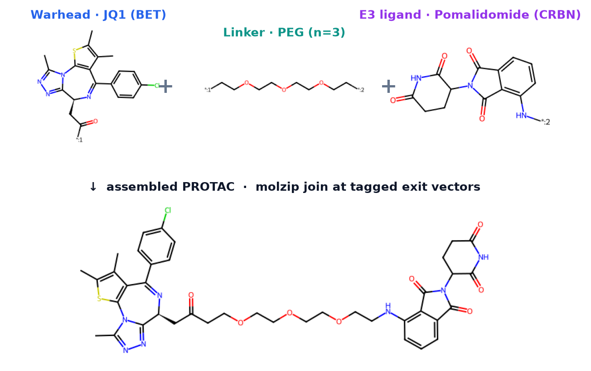
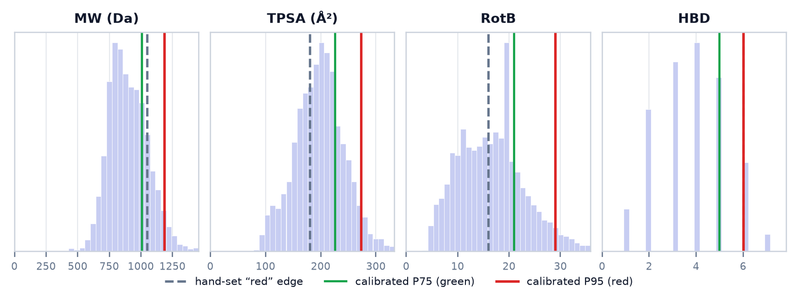
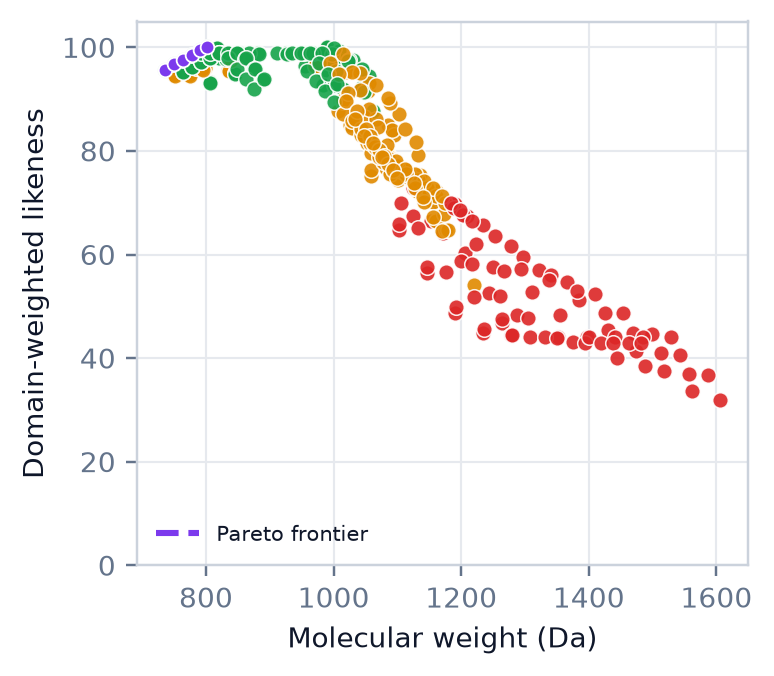

<div align="center">

# PROTACselect

**An interactive design-space explorer for PROTAC (degrader) chemistry.**

Assemble any *warhead × linker × E3-ligand* combination, view it in 3D, and score its
physicochemistry against a problem-domain objective — with thresholds **calibrated to 10,728
real PROTACs**. Sweep and rank the whole combinatorial space.

*An honest tool for the **chemistry half** of degrader design — see [Limitations](docs/LIMITATIONS.md).*

</div>

---

## What it is

- **Three-slot studio** — warhead × linker × E3 → an assembled PROTAC (RDKit `molzip`).
- **Live 3D viewer** (3Dmol.js, vendored — fully offline).
- **Tier-1 metric panel** — 10 physicochemical descriptors → traffic-light bands + a 0–100
  **PROTAC-likeness** index, **calibrated to the distribution of 10,728 PROTAC-DB degraders**, with
  each value's **percentile** in that reference set.
- **Problem domains as objective functions** — each domain is a weight vector + hard filters
  (e.g. a CNS domain caps TPSA/HBD; a BCL-xL domain *requires* a VHL handle to spare platelets).
- **Explorer** — sweep all linker×E3 combos for a warhead+domain (parametric PEG₁–₁₂ / C₂–₁₂ linkers,
  310 combinations in <1 s), ranked, with a **Pareto scatter** (likeness vs. MW).
- **SDF/MOL import & export**, and a component/domain-aware **Tip advisor**.

## What it is **not** (please read)

PROTACselect **models the ligand, not the biology.** It has no ternary complex, no cooperativity,
and **no validation against measured outcomes** (DC₅₀, Dmax, permeability). Its score measures
*how typical of known PROTACs* a molecule is — **not whether it degrades a target**. A high score does
not imply efficacy. Full detail: **[docs/LIMITATIONS.md](docs/LIMITATIONS.md)**.

The path from here to an efficacy-predicting tool is laid out in
**[docs/ROADMAP-therapeutic-efficacy.md](docs/ROADMAP-therapeutic-efficacy.md)**.

## Preview

A two-page software note (figures generated directly from the engine) is included at
**[report/PROTACselect_preprint.pdf](report/PROTACselect_preprint.pdf)**.

| Component → assembly | Calibration vs. reality | Explorer / Pareto |
|:---:|:---:|:---:|
|  |  |  |

---

## Quick start

**Prerequisites:** Python 3.10+ and Git.

```bash
git clone https://github.com/<your-username>/PROTACselect.git
cd PROTACselect

python -m venv .venv
#   Windows (PowerShell):  .venv\Scripts\Activate.ps1
#   Windows (Git Bash):    source .venv/Scripts/activate
#   macOS/Linux:           source .venv/bin/activate

pip install -r requirements.txt
```

**Run it:**

```bash
python webapp/app.py
```

Once it's running, open **http://127.0.0.1:5000** in your browser.
(The URL is also printed in the terminal. The app runs fully offline.)

> The shipped `engine/calibration.json` and `engine/distribution.json` are **aggregate statistics**
> (percentiles/thresholds — no molecule structures), so the calibrated features work out of the box.
> The underlying PROTAC-DB dataset is **not** redistributed here — see [data/NOTICE.md](data/NOTICE.md).

## Repository layout

```
engine/     scientific core: catalog, assembly, metrics, domains, advisor, calibrate, distribution
webapp/     the interactive app (Flask + 3Dmol.js)
report/     the preprint PDF + reproducible figure/report scripts
docs/       LIMITATIONS.md and the therapeutic-efficacy ROADMAP
data/       (you supply the raw dataset; see NOTICE.md)
```

## Reproduce the figures / preprint (optional)

The figures need a PROTAC SMILES file at `data/protac_smiles.smi` (see `data/NOTICE.md`); the PDF
can be rebuilt from the shipped figures without it:

```bash
pip install matplotlib reportlab pillow
python report/figs.py           # regenerate figures (needs data/)
python report/build_report.py   # rebuild the PDF from report/figs/
```

## License

Code released under the **MIT License** ([LICENSE](LICENSE)). Reference-data provenance and terms are
described in [data/NOTICE.md](data/NOTICE.md).

## Acknowledgements

Reference data from **PROTAC-DB**. Built with **RDKit**, **3Dmol.js**, and **Flask**.
